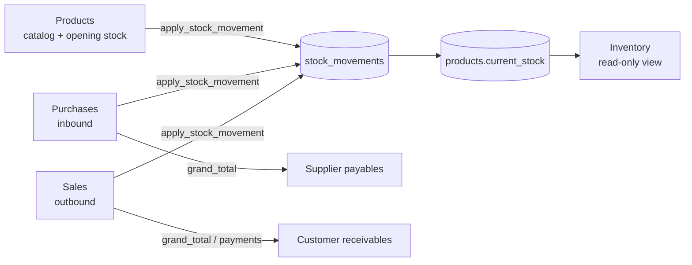

# Inventory Pipeline — Products → Purchases → Inventory → Sales

End-to-end reference for the stock and trading pipeline in Narayani Traders ERP. This document reflects the **post-implementation** state (June 2025 audit + fixes).

---

## Pipeline overview



**Quantity source of truth:** `products.current_stock` (base units).

**Audit trail:** `stock_movements` — written only when `track_inventory = true` (via `apply_stock_movement` RPC).

**All stock mutations:** Client Supabase hooks calling `apply_stock_movement()`; no API routes or server actions.

---

## Shared infrastructure (implementation pass)

| Module | Path | Role |
|--------|------|------|
| `apply_stock_movement` RPC | `schema.sql`, `supabase/migrations/20250625000000_apply_stock_movement.sql` | Atomic movement insert + `current_stock` update; no-op when `track_inventory = false` |
| Client wrapper | `lib/services/stockMovement.ts` | `applyStockMovement()`, `rollbackReferencedStock()` |
| Document rollback | `lib/services/documentRollback.ts` | `rollbackFailedDocument()`, `canDeleteSameDaySale()`, `stockReversalDelta()` |
| Quick-add products | `lib/services/productQuickAdd.ts` | `validateQuickProduct()`, `insertQuickProduct()` — blocks missing `box_purchase_price` when `has_box` |

### Deploy note

Apply `supabase/migrations/20250625000000_apply_stock_movement.sql` to hosted Supabase before using opening stock / PO / sale saves in production.

---

## Feature 1 — Products

### Purpose

Product master: SKU, pricing, box packaging, GST, `minimum_stock`, `track_inventory`, optional opening stock on create.

### Live paths

| Route | Hook |
|-------|------|
| `/features/products` | `lib/services/useProducts.ts` |

### Stock write (opening stock on add)

```
products INSERT (current_stock = 0)
  → IF opening_stock > 0: apply_stock_movement(+qty, 'opening_stock')
```

Per-product atomic via RPC. If RPC fails after product insert, product row remains (lower-risk orphan; single SKU).

### Fixed in implementation pass

- Opening stock uses `apply_stock_movement` (was non-transactional insert + direct UPDATE).
- Removed debug `console.log` auth diagnostic.
- Removed broken `low_stock` server filter stub in `useProducts`.

### Remaining gaps (documented, not fixed)

- KPI Out of Stock / Low Stock counts current page only (25 rows).
- `low_stock` status filter exists in hook but not wired in Products UI.
- Edit form cannot adjust stock after create.
- Products list shows live stock (overlaps with Inventory).

---

## Feature 2 — Purchases

### Purpose

Record purchase orders; inbound stock; increase supplier payables via `purchases.grand_total`.

### Live paths

| Route | Hook |
|-------|------|
| `/features/purchases` | `usePurchases.ts` — list, KPI, detail, **delete** |
| `/features/purchases/new` | `useNewPurchase.ts` — **save**, quick-add |

### Stock write (per line item)

```
purchases INSERT
  → FOR each line:
       purchase_items INSERT
       apply_stock_movement(+baseUnits, 'purchase', reference_id)
  → ON any failure: rollbackReferencedStock + DELETE purchases (cascade items)
```

### Fixed in implementation pass

- Save uses `apply_stock_movement` with full rollback on partial failure.
- `deletePurchase` migrated to `rollbackReferencedStock` (was manual movement delete + read-modify-write).
- Shared `insertQuickProduct` with required `box_purchase_price` when `has_box`.
- Removed dead `NewPurchaseForm.tsx` sheet (~700 lines).
- Removed duplicate `savePurchase`, `quickAddProduct`, `generatePurchaseNumber`, search helpers from `usePurchases.ts`.

### Remaining gaps (documented, not fixed)

- PO line cost does not update `products.purchase_price` (last-cost tracking deferred).
- List search filters current page only after DB pagination.
- Box sell/buy UI still falls back to unit price when box price null on **existing** catalog rows (quick-add now blocks null box purchase price).
- No PO edit; no receiving workflow.
- Document-level save still not one DB transaction (rollback on failure compensates).

---

## Feature 3 — Inventory

### Purpose

Read-only operational view: stock levels, valuation KPIs, low/out alerts, movement ledger, drill-down to PO/invoice, restock shortcuts.

**No writes** — adjustment/damage enum values exist in schema and drawer tabs but no writer in the app.

### Live paths

| Route | Hook |
|-------|------|
| `/features/inventory` | `useInventory.ts`, `page.tsx`, `StockDetailDrawer.tsx` |

### Valuation

`stock_value = current_stock × unit_cost` using catalog `purchase_price` / `box_purchase_price` — not last PO cost.

### Fixed in implementation pass

- **`bill_number` → `invoice_number`** in `useInventory.ts` (last-sale labels and movement invoice refs).
- Removed duplicate `Product` interface — re-exports from Products types.
- Removed dead `renderSortHeader`, unused `Body = TableBody`, unused sort UI wiring on page.

### Remaining gaps (documented, not fixed)

- No manual adjustment / damage entry.
- No reconciliation report (`SUM(movements)` vs `current_stock`).
- Unbounded fetches (all movements, all purchase_items, all sale_items on refresh).
- KPI total valuation includes untracked SKUs.
- Running `balanceAfter` in drawer can diverge from `current_stock` if historical drift existed pre-fix.
- Inline PO/invoice detail fetch duplicated from other features (live, not dead).

---

## Feature 4 — Sales

### Purpose

Record sales invoices; outbound stock; payments and customer balances.

### Live paths

| Route | Hook |
|-------|------|
| `/features/sales` | `useSales.ts` — list, KPI, detail, delete, record payment |
| `/features/sales/new` | `useNewSale.ts` — save, quick-add, walk-in customer |

### Stock write (per line item)

```
sales INSERT
  → FOR each line:
       sale_items INSERT
       apply_stock_movement(−baseUnits, 'sale', reference_id)
  → ON any failure: rollbackReferencedStock + DELETE sales (cascade items)
  → IF amount_paid > 0: payments INSERT (failure rolls back entire sale)
```

### Same-day delete rules

| Condition | Allowed? |
|-----------|------------|
| Same calendar day (`sale_date = today`) | Required |
| No payments | Yes |
| Exactly 1 payment, `created_at` within **5 min** of `sale.created_at` | Yes (auto-created at save) |
| 1 payment recorded later (e.g. credit sale → Record Payment) | No |
| 2+ payments | No |

Delete flow: `rollbackReferencedStock` → delete payment rows → delete sale.

### Fixed in implementation pass

- Save uses `apply_stock_movement` with rollback (including payment insert failure).
- `track_inventory` consistency via RPC (no movement/stock when untracked).
- Sale delete payment heuristic (was blocking all paid sales).
- `deleteSale` uses `rollbackReferencedStock` with correct **+delta** reversal for sales.
- Shared `insertQuickProduct`.
- Removed duplicate helpers from `useSales.ts` (`generateBillNumber`, walk-in, quickAdd, search*, `getCustomerOutstanding`).
- Fixed `setSaving(false)` on successful New Sale save.

### Remaining gaps (documented, not fixed)

- **Oversell:** UI warns only; save does not block insufficient stock (stale `current_stock` from page load).
- List search after pagination (same as Purchases).
- Credit limit advisory only on New Sale.
- No edit sale after save.
- Invoice prefix `BILL-` in UI/generator vs schema comment `INV-` (naming only).

---

## Products vs Inventory

| | Products | Inventory |
|---|----------|-----------|
| Role | Catalog + pricing master | Operational stock intelligence |
| Stock writes | Opening stock on create | None |
| Valuation KPI | No | Yes (catalog cost) |
| Movement history | Last 5 in product drawer | Full ledger + running balance |
| Reorder | — | Restock → New Purchase |

---

## What matters for this business

1. **Stock accuracy** — Inbound/outbound via `apply_stock_movement`; tracked vs untracked consistent.
2. **Partial save safety** — Purchases/Sales roll back header + stock on line failure (no orphan POs/invoices).
3. **Restock workflow** — Inventory low/out → New Purchase with supplier pre-fill.
4. **Sell without overselling** — Still warn-only; enforcement deferred.
5. **Money** — Pipeline touches stock; payables/receivables in Suppliers/Customers.
6. **Catalog cost vs true cost** — Valuation uses static product prices; last-cost write-back deferred.

---

## Explicitly deferred (future work)

- Last-cost / PO → catalog price write-back
- Inventory adjustment / damage UI
- Stock reconciliation report and repair tool
- Edit PO / sale after save
- Document-level single-transaction RPCs (`save_purchase`, `save_sale`)
- Oversell enforcement at save time
- Server-side list search (Purchases/Sales pagination bug)
- Products global low-stock KPI + filter UI

---

## File map

| Feature | Key paths |
|---------|-----------|
| Products | `app/features/products/`, `lib/services/useProducts.ts` |
| Purchases | `app/features/purchases/new/useNewPurchase.ts`, `usePurchases.ts` |
| Inventory | `app/features/inventory/_components/useInventory.ts` |
| Sales | `app/features/sales/new/useNewSale.ts`, `useSales.ts` |
| Shared | `lib/services/stockMovement.ts`, `productQuickAdd.ts`, `documentRollback.ts` |
| Schema | `schema.sql` — `apply_stock_movement()`, `increment_stock()` |

---

## Verification

Rollback shape tests: `scripts/verify-rollback-shapes.ts` (run with `npx tsx scripts/verify-rollback-shapes.ts`).

Same-day delete window constant: `AUTO_PAYMENT_WINDOW_MS` in `lib/services/documentRollback.ts` (currently 5 minutes — see reasoning below).

---

## Same-day delete window (5 minutes) — reasoning

**Why 5 minutes:** The auto-payment row is inserted in the **same client save request** as the sale header, typically within seconds. Five minutes absorbs slow networks, Supabase latency, and brief UI pauses without treating a later **Record Payment** (minutes/hours after the sale) as deletable.

**When to lengthen:** If the shop often saves a bill, gets interrupted, and completes payment collection much later **in the same flow** without using Record Payment — uncommon for counter sales.

**When to shorten:** If you need stricter protection against manual payment rows that happen to fall inside the window.

**Alternative considered:** Compare payment `amount` + count only — fails for credit-then-paid-same-amount cases; timestamp gap is more reliable.

**Not changed** pending your operational input.
